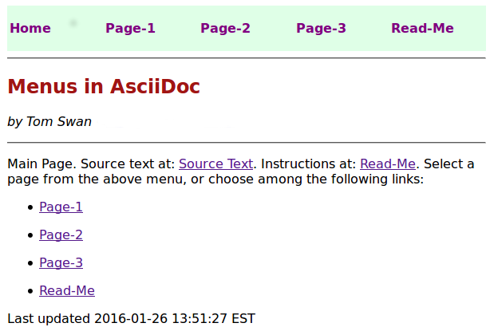

= Menus in AsciiDoc (mia-dev)

The files in this repository demonstrate a simple but effective way to add menu bars to AsciiDoc documents with no HTML skills or add-ons required. As the screenshot shows, you can even build entire multi-page linked web sites using only https://www.asciidoctor.org/[Asciidoctor] and a text editor. Also, as demonstrated, colors, fonts, and styles are fully programmable using CSS.

.Screenshot

== Download, Build, and Run

To try your own menu and web-page ideas using mia-dev as a base, download and unpack the repository ZIP file. Or, if you have http://git-scm.com/downloads[Git] installed, clone the repository directly to your system:

[source, console]
----
$ git clone https://github.com/TomSwan/mia-dev.git
Cloning into 'mia-dev'...
----

Point a browser at mia-dev/index.html to view the demonstration HTML pages. Or, view the demonstration web site online here:

http://www.tomswan.com/pub/menus-in-asciidoc/

Make changes to the source code .adoc text files, all in AsciiDoc markup. Also inspect the index.adoc and menu-include.adoc files. Select the provided links to switch between HTML-formatted screens and the source text that produces those pages. Run make to rebuild, make clean to erase, the HTML output files:

[source, console]
----
$ make clean
$ nano page1.adoc
...
$ make
----

PS: On Linux, nano is a simple but useful plain-text editor, but you can use any other. Type ctrl+o and ctrl+x to save and get out of nano.

== Updates

Fetch any updates for this project from GitHub. Go into your cloned mia-dev folder and issue git fetch and pull commands:

[source, console]
----
$ cd /clones/mia-dev
$ git fetch
$ git pull
----

== Uninstall

To return to this repository's original state as first published in 2016, _after_ staging and git-committing any and all changes, checkout the original branch:

[source, console]
----
$ cd /clones/mia-dev
$ git add .
$ git commit -m 'going into the past'
$ git checkout original
----

After looking around, checkout the master branch to come back to the future. (Wait. When is now again?)

To completely uninstall the demo, simply delete the mia-dev folder.

== More Information

The information in this file is the latest and greatest on mia-dev. You'll also find a simpler doc.txt file in the repository that, while accurate, is only for the demonstration "web site." Of course, as always, the best documentation is the source code itself.

Please also visit my web site (generated, naturally, using Asciidoctor). Good luck!

http://www.tomswan.com
